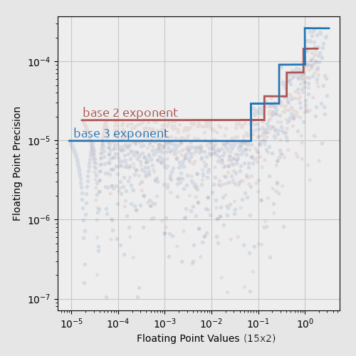

# Toyfloat

It encodes and decodes floating-point numbers with a width of 3 to 16 bits.

Expected applications:

* file format design,
* lossy compression.

It has:

* exact 0, 1, -1
* no NaN, -Inf, +Inf
* values, that are in range about:
  * (-256, +256) for 4-bit exponent
  * (-4, +4) for 3-bit exponent
  * (-3, +3) for 2-bit exponent


```
Examples:

____ sxxx xmmm mmmm - 12-bit
____ xxxx mmmm mmmm - 12-bit unsigned
___s xxxx mmmm mmmm - 13-bit
__sx xxxm mmmm mmmm - 14-bit
_sxx xmmm mmmm mmmm - 15-bit with 3-bit exponent
```


Base 3 in 2-bit exponent provides a higher density
of values close to zero and a wider range,
at the cost of reduced precision of values greater than 1/3.



## Usage

```go
package main

import (
	"fmt"
	"github.com/georgy7/toyfloat"
	"math"
	"os"
)

func exitOnError(err error) {
	if err != nil {
		println("impossible type")
		os.Exit(1)
	}
}

func report(header string, tf uint16, f, v float64) {
	println(header)
	for i := 0; i < len(header); i++ {
		print("-")
	}
	println()
	fmt.Printf("Encoded: 0x%X\n", tf)
	fmt.Printf("Decoded: %f\n", f)
	fmt.Printf("Delta:   %f\n\n", math.Abs(f-v))
}

func main() {
	println()

	toyfloat12, err12 := toyfloat.NewTypeX4(12, true)
	toyfloat13, err13 := toyfloat.NewTypeX4(13, true)
	toyfloat14, err14 := toyfloat.NewTypeX4(14, true)
	toyfloat15x3, err15x3 := toyfloat.NewTypeX3(15, true)
	toyfloat5x3, err5x3 := toyfloat.NewTypeX3(5, true)
	toyfloat5x2, err5x2 := toyfloat.NewTypeX2(5, true)
	toyfloat3x2u, err3x2u := toyfloat.NewTypeX2(3, false)

	exitOnError(err12)
	exitOnError(err13)
	exitOnError(err14)
	exitOnError(err15x3)
	exitOnError(err5x3)
	exitOnError(err5x2)
	exitOnError(err3x2u)

	const input = 1.567
	fmt.Printf("Input:   %f\n\n", input)

	tf := toyfloat12.Encode(input)
	f := toyfloat12.Decode(tf)
	report("12-bit signed", tf, f, input)

	tf = toyfloat13.Encode(input)
	f = toyfloat13.Decode(tf)
	report("13-bit signed", tf, f, input)

	tf = toyfloat14.Encode(input)
	f = toyfloat14.Decode(tf)
	report("14-bit signed", tf, f, input)

	tf = toyfloat15x3.Encode(input)
	f = toyfloat15x3.Decode(tf)
	report("15-bit signed with 3-bit exponent", tf, f, input)

	tf = toyfloat5x3.Encode(input)
	f = toyfloat5x3.Decode(tf)
	report("5-bit signed with 3-bit exponent", tf, f, input)

	tf = toyfloat5x2.Encode(input)
	f = toyfloat5x2.Decode(tf)
	report("5-bit signed with 2-bit exponent", tf, f, input)

	tf = toyfloat3x2u.Encode(input)
	f = toyfloat3x2u.Decode(tf)
	report("3-bit unsigned with 2-bit exponent", tf, f, input)

	println()
	println("Delta encoding (12-bit)")
	println("-----------------------\n")

	series := []float64{
		-0.0058, 0.01, 0.066, 0.123,
		0.134, 0.132, 0.144, 0.145, 0.140}

	previous := toyfloat12.Encode(series[0])
	pDecoded := toyfloat12.Decode(previous)

	fmt.Printf("  Int. delta    Fp delta    Value\n")
	fmt.Printf("  % 35.6f\n", pDecoded)

	for i := 1; i < len(series); i++ {
		this := toyfloat12.Encode(series[i])
		delta := toyfloat12.GetIntegerDelta(previous, this)

		x := toyfloat12.Decode(this)
		fpDelta := x - pDecoded
		fmt.Printf("  %+10d    %+.6f   % .6f\n", delta, fpDelta, x)

		previous = this
		pDecoded = toyfloat12.Decode(previous)
	}

	println()
}
```

```shell
go get -u github.com/georgy7/toyfloat
go run example.go
```

```
Input:   1.567000

12-bit signed
-------------
Encoded: 0x448
Decoded: 1.564706
Delta:   0.002294

13-bit signed
-------------
Encoded: 0x891
Decoded: 1.568627
Delta:   0.001627

14-bit signed
-------------
Encoded: 0x1121
Decoded: 1.566667
Delta:   0.000333

15-bit signed with 3-bit exponent
---------------------------------
Encoded: 0x3477
Decoded: 1.566964
Delta:   0.000036

5-bit signed with 3-bit exponent
--------------------------------
Encoded: 0xD
Decoded: 1.507937
Delta:   0.059063

5-bit signed with 2-bit exponent
--------------------------------
Encoded: 0xD
Decoded: 1.519231
Delta:   0.047769

3-bit unsigned with 2-bit exponent
----------------------------------
Encoded: 0x7
Decoded: 2.038462
Delta:   0.471462


Delta encoding (12-bit)
-----------------------

  Int. delta    Fp delta    Value
                            -0.005821
        +387    +0.015809    0.009988
        +300    +0.056189    0.066176
        +114    +0.056373    0.122549
         +12    +0.011765    0.134314
          -2    -0.001961    0.132353
         +12    +0.011765    0.144118
          +1    +0.000980    0.145098
          -5    -0.004902    0.140196
```
