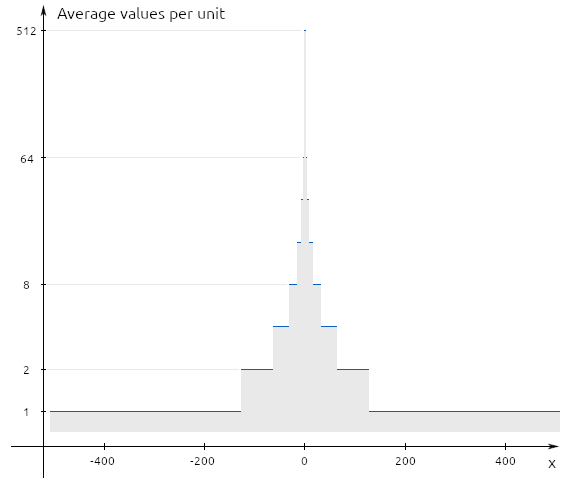

# Toyfloat

12-bit floating-point library.

Expected applications:

* File Format Design
* Storing colors (pixels, voxels)

It has:

* 7 bits normalized significand
* 4 bits exponent
* 1 sign bit
* -510..510 values range
* up to 0.01 precision
* exact representation of integers up to 256
* no infinities
* no NaN

