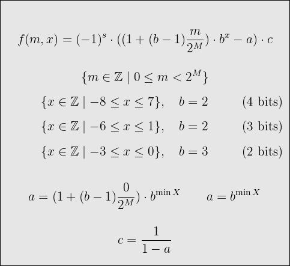
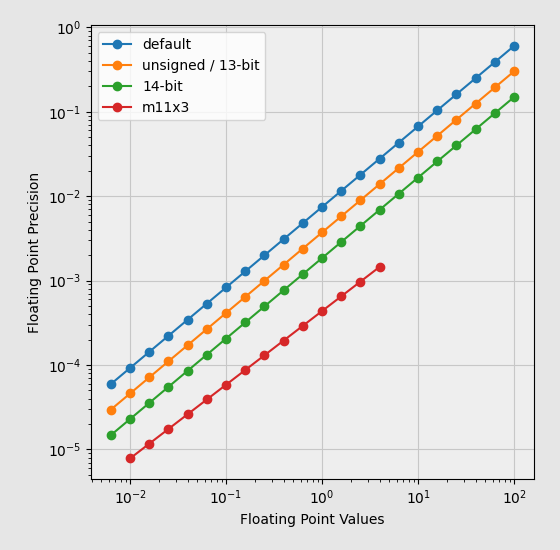

# Toyfloat

It encodes and decodes floating-point numbers with a width of 12 to 15 bits.

Expected applications:

* file format design,
* lossy compression.

It has:

* exact 0, 1, -1
* no NaN
* values, that are in range about:
  * (-256, +256) for 4-bit exponent
  * (-4, +4) for 3-bit exponent



```
____ sxxx xmmm mmmm - 12-bit
____ xxxx mmmm mmmm - 12-bit unsigned
___s xxxx mmmm mmmm - 13-bit
__sx xxxm mmmm mmmm - 14-bit
_sxx xmmm mmmm mmmm - 15-bit with 3-bit exponent
```



## Usage

```go
package main

import (
	"fmt"
	"github.com/georgy7/toyfloat"
)

func main() {
	println()

	tf := toyfloat.Encode12(0.345)
	fmt.Printf("0x%X\n", tf)

	f := toyfloat.Decode12(tf)
	fmt.Printf("%f\n\n", f)

	tf = toyfloat.Encode13(0.345)
	fmt.Printf("0x%X\n", tf)

	f = toyfloat.Decode13(tf)
	fmt.Printf("%f\n\n", f)

	tf = toyfloat.Encode14(0.345)
	fmt.Printf("0x%X\n", tf)

	f = toyfloat.Decode14(tf)
	fmt.Printf("%f\n\n", f)

	tf = toyfloat.Encode15X3(0.345)
	fmt.Printf("0x%X\n", tf)

	f = toyfloat.Decode15X3(tf)
	fmt.Printf("%f\n\n", f)

	series := []float64{-0.0058, 0.01, 0.123, 0.134, 0.132, 0.144, 0.145, 0.140}
	previous := toyfloat.Encode12(series[0])
	for i := 1; i < len(series); i++ {
		this := toyfloat.Encode12(series[i])
		delta := toyfloat.GetIntegerDelta12(previous, this)
		fmt.Printf("%d\n", delta)
		previous = this
	}
}
```

```shell
go get -u github.com/georgy7/toyfloat
go run example.go
```

```
0x332
0.345098

0x664
0.345098

0xCC8
0.345098

0x235E
0.344990

387
414
12
-2
12
1
-5
```
