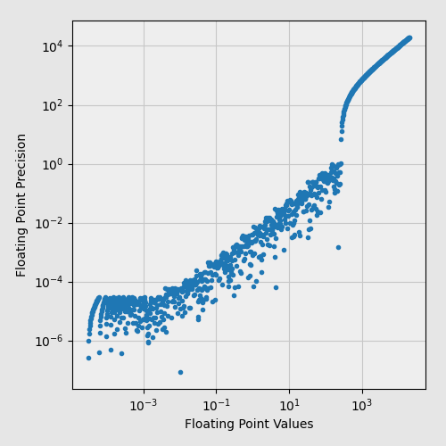

# Toyfloat

12-bit floating-point library.

Expected applications:

* file format design
* lossy compression

It has:

* 7 bits normalized significand
* 4 bits exponent
* 1 sign bit
* (-255.9961, 255.9961) values range
* exact 0, 1, -1
* no NaN




## Other options

```
____ xxxx mmmm mmmm (unsigned)
___s xxxx mmmm mmmm (13-bit)
__xx xxsm mmmm mmmm (14-bit)
```
