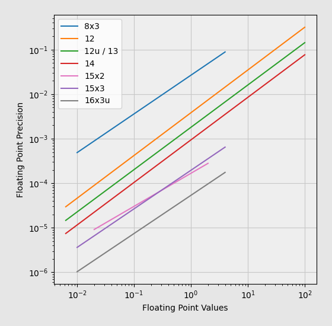

# Toyfloat

12-bit floating-point library.

Expected applications:

* file format design
* lossy compression

It has:

* 7 bits normalized significand
* 4 bits exponent
* 1 sign bit
* (-255.9961, 255.9961) values range
* exact 0, 1, -1
* no NaN


```
____ xxxx smmm mmmm - default
____ xxxx mmmm mmmm - unsigned
___s xxxx mmmm mmmm - 13-bit
__xx xxsm mmmm mmmm - 14-bit
_xxx smmm mmmm mmmm - m11x3
```



## Usage

```go
package main

import (
	"fmt"
	"github.com/georgy7/toyfloat"
)

func main() {
	println()

	tf := toyfloat.Encode(0.345)
	fmt.Printf("0x%X\n", tf)

	f := toyfloat.Decode(tf)
	fmt.Printf("%f\n\n", f)

	tf = toyfloat.Encode13(0.345)
	fmt.Printf("0x%X\n", tf)

	f = toyfloat.Decode13(tf)
	fmt.Printf("%f\n\n", f)

	tf = toyfloat.Encode14(0.345)
	fmt.Printf("0x%X\n", tf)

	f = toyfloat.Decode14(tf)
	fmt.Printf("%f\n\n", f)
}
```

```shell
go get github.com/georgy7/toyfloat
go run example.go
```

```
0x631
0.343137

0x663
0.344118

0x18C7
0.344608
```
